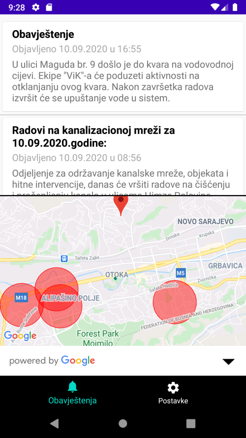

# VodovodInfoApp
This is an app that collects water outage notices from Sarajevo's government water supply company, locates areas on the map and notifies users accordingly.

## Implementation

Following recent dive into **MVVM**, **LiveData**, **Room**, **Hilt**, and **GoogleMaps** I came up with the idea to make an app that will summarize my current knowledge about these topics and to be useful to people of Sarajevo as well. 
I was also inspired by [CodingWithMitch Power Outages App][cwm].

This app uses: 
 - **MVVM** architectural pattern
 - **Jsoup** (Java HTML parser) to scrape data from [viksa.ba][vm]
 - **Repository pattern** as a single source of truth
 - **LiveData** to appropriately notifies *Presentation (UI) layer* accordingly to observers livecycle.
 - **Google geolocate API** to locate streets mentioned in notices
 - **Google maps** to display the data
 - **Room persistence library** is used to manage the data retrieval
 - **Hilt** is used to provides a standard way to do **DI injection**
 - **WorkManager** and periodic **Worker** for local notifications
 

## What I learned
- How to implement **MVVM pattern** and I made a **Medium** tutorial explaining it: 
  [MVVM w/ LiveData & How To Use It | PiLove notes][mvvm]
- How to use **Room persistence library** and I made a **Medium** tutorial explaining it as well:
[How to Use Room | Android (JetPack) | PiLove notes][room]
- How to use **Hilt** and I made a **Medium** tutorial explaining it also:
 [Hilt: God’s Response To Our Prayers | PiLove notes][hilt]
- How to propery use **Kotlin coroutines** and I made a **Medium** tutorial explaining it as well:
 [Coroutines | Pilove Notes][coro]
- How to use **Google geolocate API** and **Google maps**
- How to use **WorkManager** and schedule a period **Worker**
- How to use properly **LiveData** with multiple data sources and observe it
- How to listen to **network** status changes and respond accordingly
- How to properly hide *credentials*
- How to set **navigation graph** and properly set **transactions**

[cwm]: <https://www.youtube.com/watch?v=69kA1xiVvkU&t=513s>
[vm]: <http://www.viksa.ba/>
[mvvm]: <https://medium.com/@adipilav/mvvm-w-livedata-how-to-use-it-pilove-notes-7ebfc9789a05>
[hilt]: <https://medium.com/android-dev-hacks/hilt-gods-response-to-our-prayers-pilove-notes-a0ef30db983f?source=friends_link&sk=e039fc0b9939af44197cc4d08df2902c>
[room]: <https://medium.com/swlh/how-to-use-room-android-jetpack-pilove-notes-8a3b2a64631d?source=friends_link&sk=dbfc08dc552cb57ed41a276bce1d7e65>
[coro]: <https://medium.com/swlh/coroutines-pilove-notes-cb83654a88d4?source=friends_link&sk=6a73b5234201bf3bd91361b79cdd4278>

